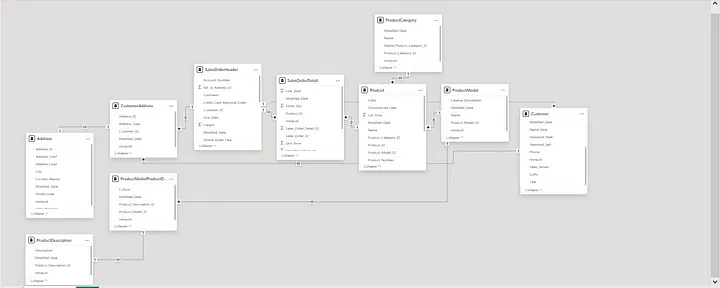

## End-to-End Azure Data Engineering Project

This project focuses on building a complete End to End Azure Data Engineering Project from Data Ingestion, Data Transformation, Data Loading to Data Visualization.

The Tech Stack used includes some resources in Azure which are:

1. Azure Data Factory: This resource was used for Data Ingestion in this project by building data pipelines. [*Azure Data Factory Documentation*](https://learn.microsoft.com/en-us/azure/data-factory/)

2. Azure Data Lake Storage Gen2: This was used to store data in their RAW format both in parquet and delta format respectively. [*Azure Data Lake Storage Gen2 Documentation*](https://learn.microsoft.com/en-us/azure/storage/blobs/data-lake-storage-introduction)

3. Azure Databricks: For data transformation using Python Language. [*Azure Databricks Documentation*](https://learn.microsoft.com/en-us/azure/databricks/)

4. Azure Synapse Analytics: For Data warehousing (by using a serverless database over a dedicated database due to the small quantity of the data) and querying of data. [*Azure Synapse Analytics Documentation*](https://learn.microsoft.com/en-us/azure/synapse-analytics/)

5. Azure Key Vault: This resource was used to save/store and manage sensitive information like secrets, keys, and certificates e.g database username and password, databricks workspace access token etc. [*Azure Key Vault Documentation*](https://learn.microsoft.com/en-us/azure/key-vault/)

6. Microsoft Entra ID (Previously known as Azure Active Directory): To manage the governance and user management of the resource group by creating security groups. [*Microsoft Entra ID Documentation*](https://learn.microsoft.com/en-us/entra/identity/)

7. Microsoft Power BI: For data modeling and visualization. [*Microsoft Power BI Documentation*](https://learn.microsoft.com/en-us/power-bi/)

## Project Prerequisite
1. You need a Microsoft Azure account.
2. You need an Azure subscription or an Azure for student subscription.

## Project Architecture

<em>Project Architecture</em>

*Note: Firstly, you need to create a resource group in Azure that houses all the resources listed above (aside the Microsoft Power BI).*

## End-to-End Data Pipeline

<em>Pipeline 1</em>

<em>Pipeline 2</em>

## Data Ingestion
The Data Ingestion process starts by connecting to the Data source (which is the AdventureWorksLT2017 and you can download it [*here*](https://learn.microsoft.com/en-us/sql/samples/adventureworks-install-configure?view=sql-server-ver16&tabs=ssms)) with the help of the Microsoft Integration Runtime.

*Note: Upon creating the Azure Data Factory resource, it automatically creates an auto resolve integration runtime which you can use to connect to other cloud resources like Azure Synapse Analytics. But to connect to an on-premise Data source you need the Microsoft Integration Runtime*

- The first step in this data pipeline uses the lookup activity to look for all the tables belonging to a particular schema by using a sql query.

<em>select s.name as SchemaName, t.name as TableName from sys.tables t INNER JOIN sys.schemas s on t.schema_id = s.schema_id where s.name = ‘SalesLT’</em>

- The second step uses the For Each activity to dynamically select * from all the tables in the result of the look up activity and store the data in the as-is-staging container in Azure Data Lake Storage Gen2 (in a parquet format).

## Data Transformation
*Note: To mount the Azure Data Lake Storage Gen2 to the DBFS, credential passthrough was used. You can read more on this [here](https://learn.microsoft.com/en-us/azure/databricks/archive/credential-passthrough/adls-passthrough).*

- The third step uses Azure Databricks Notebook to perform the first-level transformation which uses the python language to convert all the date columns to a date format and store the result in the firstleveltransformation container in Azure Data Lake Storage Gen2 (in a delta format).

- The fourth step uses Azure Databricks Notebook to perform the second-level transformation which uses the python language to convert all the column name header from PascalCase to snake_case naming convention and store the result in the secondleveltransformation container in Azure Data Lake Storage Gen2 (in a delta format).

*Note: The first container in Azure Data Lake Storage Gen2 is stored in parquet format because that is the data source in its raw format while the other two containers store the transformed data in delta format because **"Delta keeps version history"***.

## Data Loading
- This is the step where the data is loaded from the secondleveltransformation container in Azure Data Lake Storage Gen2 into the Azure Synapse Analytics (Serverless DB) using a stored procedure that dynamically creates a view for all the tables.

## Data Modeling and Visualization
- Using Azure Synapse Analytics Data connector in Power BI the loaded data in the Azure Synapse Analytics is imported into Power BI to build simple interactive dashboards that provide real-time insights. You can view the dashboard [here](https://app.powerbi.com/view?r=eyJrIjoiOTUxYzZiZWMtYjViMS00NzkwLTk1YTQtMjFjZjQ2YTgwYjMzIiwidCI6IjBiMjFjNDRjLWI1ZDAtNDE1MS04OTI5LTNkZjc0Nzg2OTA0NiJ9).

<em>Dashboard</em>

- Data Modeling is done in Power BI to communicate connections/relationships between data points and structures.

<em>Data Model</em>

## Security and Governance
- Microsoft Entra ID helps to securing the data platform and also implement security by creating security groups, so that certain roles can be given to such groups.

- Azure Key Vault helps to save/store and manage sensitive information like secrets, keys, and certificates.

## Triggers
- Triggers in ADF is used to schedule the refresh of the data by running the data pipeline at the specified time and interval.

<em>Triggers</em>

